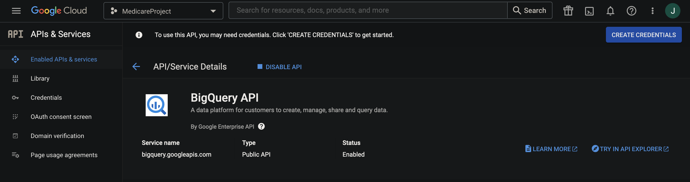

# Google BigQuery Project

This project uses Google Cloud’s BigQuery API to run queries on public databases.

Note: In order to run this project, authentication credentials are needed from Google.
This can be obtained from signing up to cloud.google.com (Google offers a free trial for
this) and downloading the credentials as a .json file. The location for the authentication 
file placement will be noted in each program as 'INSERT .JSON CREDENTIAL FILENAME'.

### Databases Used

* [Medicare](https://www.cms.gov/Outreach-and-Education/MLN/Educational-Tools/MLN901347-How-to-MCD/mcd/mcd/index.html)
* [ICD 10](https://www.cms.gov/Medicare/Coding/ICD10)
* [OpenAQ](https://openaq.org/#/about)

### Libraries Used

* [Google Cloud](https://cloud.google.com/docs)
* [Pandas](https://pandas.pydata.org/)
* [MatPlotLib](https://matplotlib.org/)
* [Seaborn](https://seaborn.pydata.org/)

---

*Project taken from "Python All in One for Dummies" by John Shovic and Alan Simpson*
