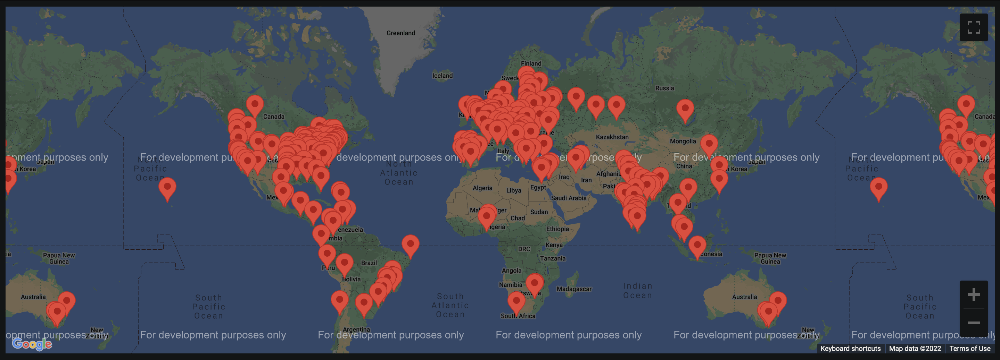

# Data Visualization with Google Geocoding API

## Summary

This project uses the Google Geocoding API to clean up user-entered geographic locations of
universities and places the data on a Google Map for visualization as seen below.

*Note: As of December 2016, the Google Geocoding APIs changed dramatically.
They moved some functionality from the Geocoding API into the Places API. 
Also all the Google Geo-related APIs require an API key.*

To try this with the API key, follow the instructions at:

https://developers.google.com/maps/documentation/geocoding/intro

and put the API key in the code.

## geoload.py, geodata.sqlite, & geodump.py

The first five locations are already in the database and so they
are skipped.  The program scans to the point where it finds un-retrieved
locations and starts retrieving them.

The geoload.py can be stopped at any time, and there is a counter
that you can use to limit the number of calls to the geocoding
API for each run.

Once you have some data loaded into geodata.sqlite, you can
visualize the data using the (geodump.py) program.  This
program reads the database and writes the file (where.js)
with the location, latitude, and longitude in the form of
executable JavaScript code.

## where.html & where.js

The file where.js is a JavaScript list of lists. Note that the syntax for JavaScript
list constants is very similar to Python.

Open where.html to view the data in a browser

The file (where.html) consists of HTML and JavaScript to visualize
a Google Map.  It reads the most recent data in where.js to get
the data to be visualized.

Simply open where.html in a browser to see the locations.  You
can hover over each map pin to find the location that the
geocoding API returned for the user-entered input.  If you
cannot see any data when you open the where.html file, you might
want to check the JavaScript or developer console for your browser.

---

*This project is a part of the "Using Databases with Python" course from the "Python for Everybody" specialization by Dr. Charles Severance*
